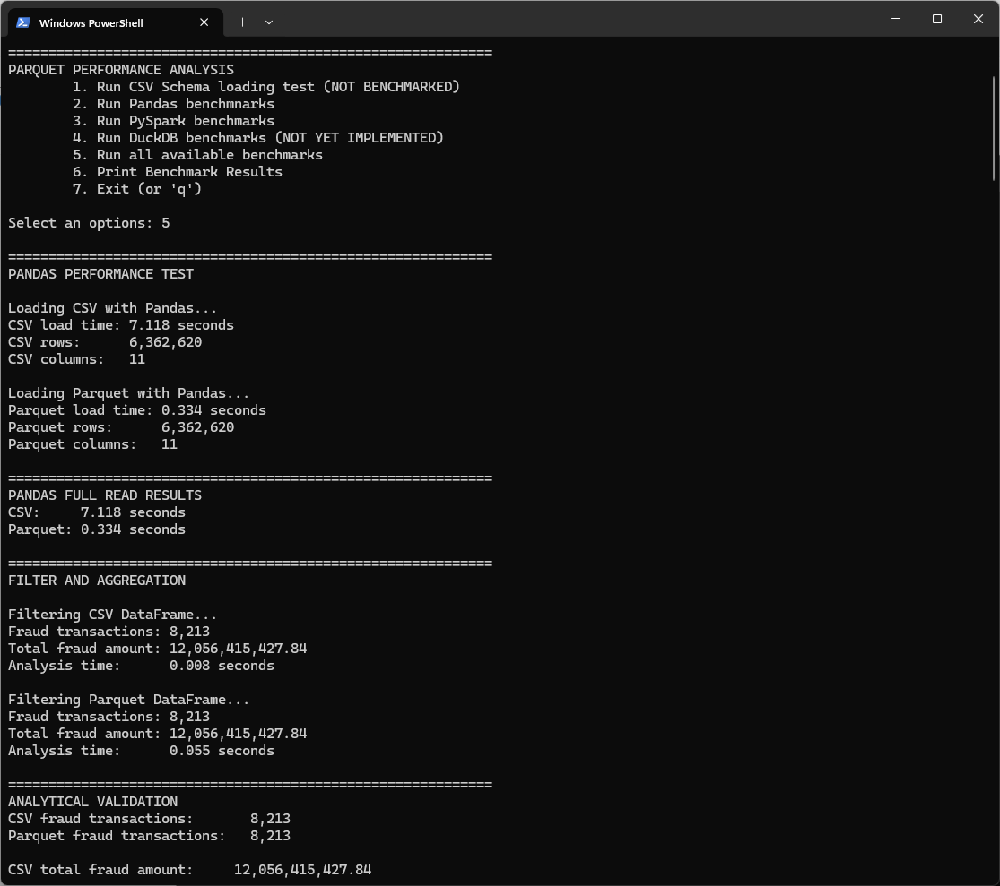
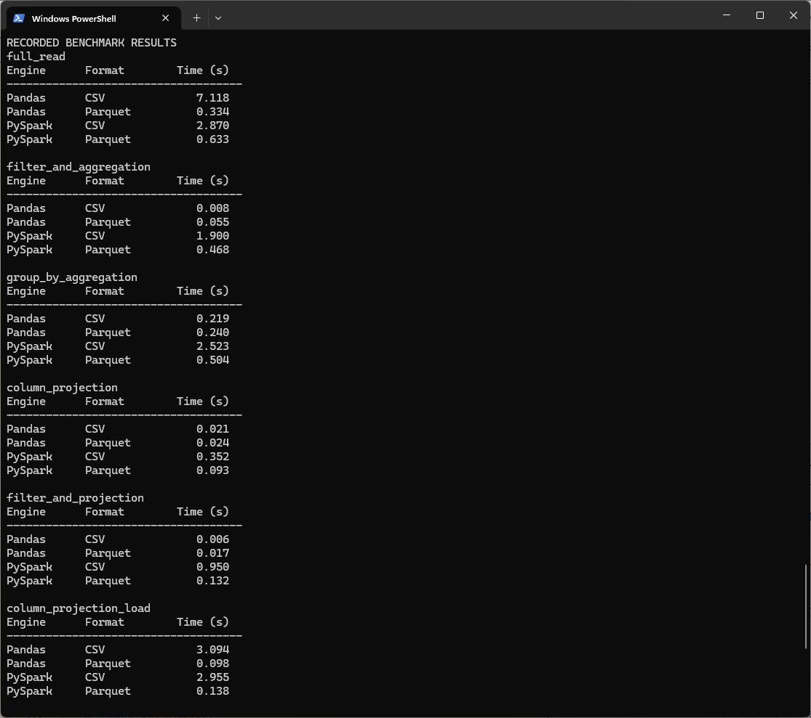

# Parquet Performance Analysis

A data engineering project investigating the performance differences between **CSV and Parquet** when processing a large transaction dataset with **Pandas, PySpark and DuckDB**.

The project uses the same underlying dataset in both CSV and Parquet formats so that the performance comparisons can be made under consistent conditions.

## AIML Dataset

| Column           | Data Type |
| ---------------- | --------- |
| `step`           | LONG      |
| `type`           | VARCHAR   |
| `amount`         | DOUBLE    |
| `nameOrig`       | VARCHAR   |
| `oldbalanceOrg`  | DOUBLE    |
| `newbalanceOrig` | DOUBLE    |
| `nameDest`       | VARCHAR   |
| `oldbalanceDest` | DOUBLE    |
| `newbalanceDest` | DOUBLE    |
| `isFlaggedFraud` | LONG      |
| `isFraud`        | LONG      |

The AIML Fraud dataset can be downloaded in CSV format from:

https://www.kaggle.com/datasets/amanalisiddiqui/fraud-detection-dataset

You will need to convert it to Parquet format yourself.

## Project Goals

The project investigates how storage format and processing engine affect:

* File size
* Data loading time
* Column projection
* Filtering
* Aggregation
* Analytical query performance

The benchmark compares six combinations:

| Engine  | CSV | Parquet |
| ------- | :-: | :-----: |
| Pandas  |  ✓  |    ✓    |
| PySpark |  ✓  |    ✓    |
| DuckDB  |  ✓  |    ✓    |

The same analytical workloads are applied to each combination.

Current benchmark workloads include:

1. Full dataset read
2. Filter and aggregation
3. Group-by aggregation
4. In-memory column projection
5. Direct column projection from disk
6. Filter and projection

## Benchmark Output

The project provides an interactive command-line menu for running the
different benchmark stages.



Example benchmark results are displayed grouped by workload and
processing engine:



## Dataset

The project uses a large financial transaction dataset containing approximately **6.36 million transactions**.

The dataset contains 11 columns including:

* Transaction type
* Transaction amount
* Origin and destination accounts
* Account balances
* Fraud indicators

The CSV and Parquet files contain the same underlying data.

The dataset files are **not included in this repository** because of their size.

Expected files:

```text
data/

├── AIML Dataset.csv
└── AIML Dataset.parquet
```

## Current Progress

### Milestone 1 — PySpark data validation

Completed.

PySpark successfully loads both the CSV and Parquet datasets using an explicit schema for the CSV file.

Current validation confirms:

* CSV rows: **6,362,620**
* Parquet rows: **6,362,620**
* CSV and Parquet schemas match
* Dataset validation: **PASS**

### Milestone 2 — Pandas analysis

Completed initial Pandas workloads.

The Pandas runner now supports the common benchmark workloads used by the project, including:

* Full dataset loading
* Filtering and aggregation
* Group-by aggregation
* Column projection
* Direct column projection from disk
* Filtering and projection

### Milestone 3 — PySpark benchmark

Completed initial PySpark workloads using the same benchmark structure as Pandas.

The PySpark runner supports the same six analytical workloads, allowing CSV and Parquet performance to be compared using equivalent operations.

### Milestone 4 — Benchmark framework

Completed the initial common benchmark structure.

The project now includes:

* A common `Benchmark` class for storing benchmark results
* A common `BenchmarkResult` structure
* Result validation for equivalent CSV and Parquet operations
* Engine-specific result replacement when a benchmark is rerun
* Readable grouped benchmark result output
* An interactive menu for running individual benchmark groups

The menu allows individual tests to be run without executing the entire benchmark suite.

### Milestone 5 — CSV schema loading experiment

Completed initial schema-loading experiment using PySpark.

The experiment compares:

* Spark schema inference
* An explicitly declared schema

Progressively larger CSV datasets are tested at:

* 10%
* 25%
* 50%
* 75%
* 100%

Initial testing indicates that explicitly declaring the schema can substantially reduce CSV loading time in the current environment.

This experiment is kept separate from the main CSV vs Parquet benchmark.

### Dataset size

The full dataset files are approximately:

| Format  |      Size |
| ------- | --------: |
| CSV     | 470.67 MB |
| Parquet | 252.90 MB |

Benchmark timings are currently preliminary single-run measurements and are **not intended to represent final benchmark results**. Repeated measurements and median timings will be introduced before final results are analysed.

## Planned Work

The project will progressively add:

1. DuckDB CSV vs Parquet analysis
2. Repeated measurements and median timing
3. Storage-location comparisons
4. Benchmark result export and analysis
5. Parquet compression comparisons
6. Partitioned Parquet experiments
7. Spark execution-plan analysis

## Project Structure

```text
parquet-performance-analysis/

│
├── data/
│   ├── AIML Dataset.csv
│   ├── AIML Dataset.parquet
│   └── resized/
│
├── src/
│   ├── benchmark.py
│   ├── dataset_loader.py
│   ├── pandas_runner.py
│   ├── pandas_tests.py
│   ├── pyspark_runner.py
│   ├── pyspark_tests.py
│   └── utils.py
│
├── results/
│
├── notebooks/
│
├── tests/
│
├── main.py
├── requirements.txt
├── README.md
└── .gitignore
```

The dataset files and generated benchmark results are excluded from version control.

## Technologies

* Python
* Pandas
* DuckDB
* PySpark

## Purpose

This project is intended as a practical exploration of data-engineering concepts including columnar storage, analytical processing, file formats, query performance and distributed data processing.
